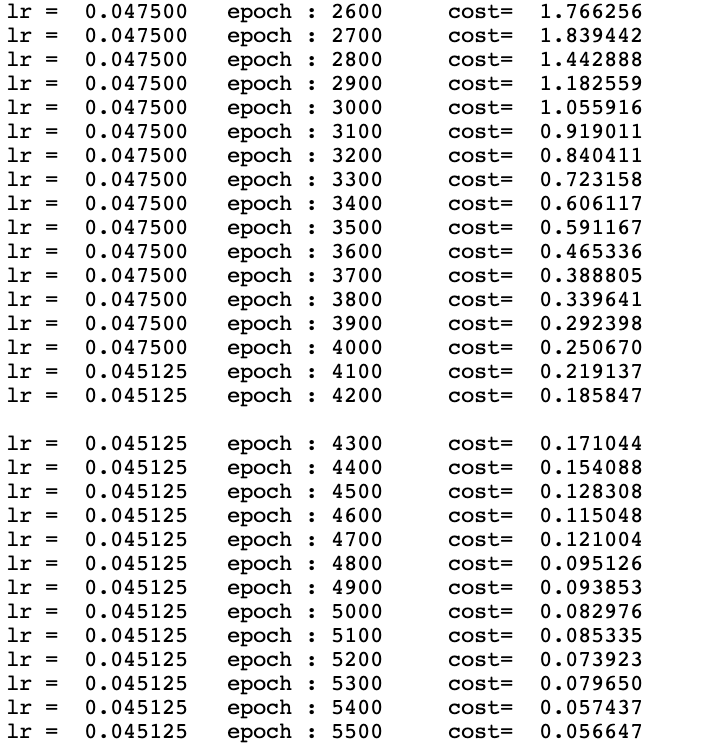

# ocr-handwritten

This repo is be used for ocr-handwritten recognition via CRNN

# Quick start


## build environment

```shell script
conda create -n  ocr-cn python=3.6 pip scipy numpy ##运用conda 创建python环境
source activate ocr-cn
pip install -r requirements.txt -i https://mirrors.163.com/pypi/simple/
```

## prepare data


## training 

```shell script
sh train-cn.sh
```

training sreenshot


## train on AWS SageMaker