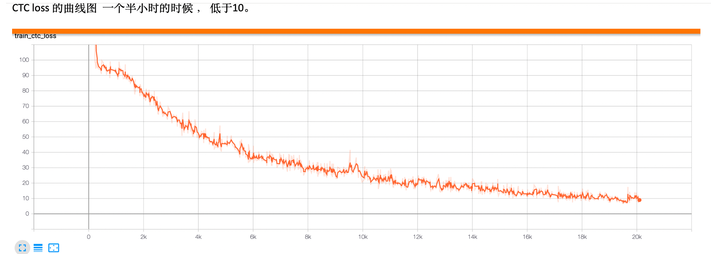

# ocr-handwritten

This repo is be used for ocr-handwritten recognition via CRNN

# Quick start


## build environment

```shell script
conda create -n  ocr-cn python=3.6 pip scipy numpy ##运用conda 创建python环境
source activate ocr-cn
pip install -r requirements.txt -i https://mirrors.163.com/pypi/simple/
```

## prepare data

we have two ways to generate input data
* from open source
* use trdggenerate 

sample input data generated by trdg


sample input data from open source


handwritten sample


```shell script
# download handwritten data
cd ./recognize_process/shell
sh download_handwritten_data.sh

#generate tfrecord
sh generation_handwritten_tfrecord.sh ./label.txt 0.2
```

## training 

```shell script
sh train-cn.sh
```

training sreenshot




### test

```shell script
sh test-cn.sh
```
test result after 30 min training


## train on AWS SageMaker